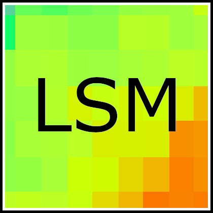

  
# **LocallyStationaryModels**
***authors:*** Giacomo De Carlo, Luca Crippa 
***mailto:*** <gdecarlo@retitech.ai>, <luca7.crippa@mail.polimi.it> 
## **Installation**
### **Step 1: install R and Rstudio (optional)**
#### **Windows:**
Download R from <https://cran.r-project.org/bin/windows/base/> and (optional) Rstudio from <https://www.rstudio.com/products/rstudio/download/>.
#### **Arch Linux:**
Open the terminal then type:

    sudo pacman -S r

and install the `r` package for R.
To get Rstudio (optional), install an AUR helper of your choice such as <https://github.com/Jguer/yay> and then on the terminal:

    yay -S rstudio-desktop-bin

Refer to <https://wiki.archlinux.org/title/r> for further details.
#### **Ubuntu:**
Refer to <https://cran.r-project.org/bin/linux/ubuntu/> for R.
For Rstudio (optional) you can download the `.deb` file from <https://www.rstudio.com/products/rstudio/download/>.
### **Step 2: install LocallyStationaryModels**
#### **Option 1: via devtools (suggested)**
Open R and type:

    install.packages("devtools")

to install `devtools`. Then type:

    library(devtools)
    devtools::install_github("g-decarlo/FunctionalLSM")

to install `LocallyStationaryModels`.

#### **Option 2: via zip file**
In alternative you can download the source code from github, unzip the file and run from the terminal:

    R CMD INSTALL <path name of the package to be installed> -l <path name of the R library tree>

⚠️ **Beware:** since `LocallyStationaryModels` is written in C++, it requires the appropriate tools to be compiled and run. On Windows this can be done by installing <https://cran.r-project.org/bin/windows/Rtools/rtools40.html> (don't worry, R itself will redirect you to the appropriate web page if `Rtools` is not present on your pc), while on Linux you have to manually install them from the repositories of your distribution.
